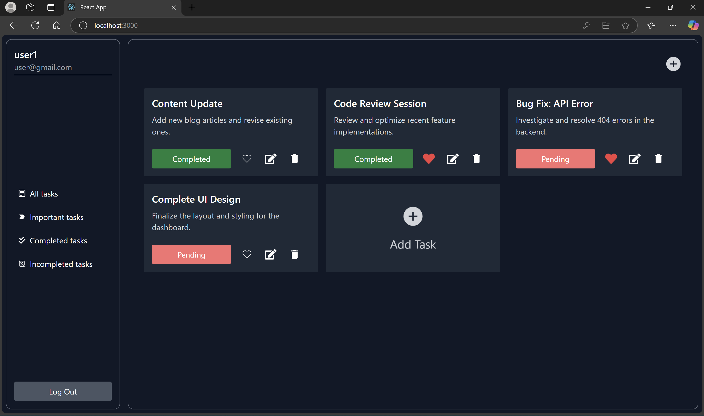
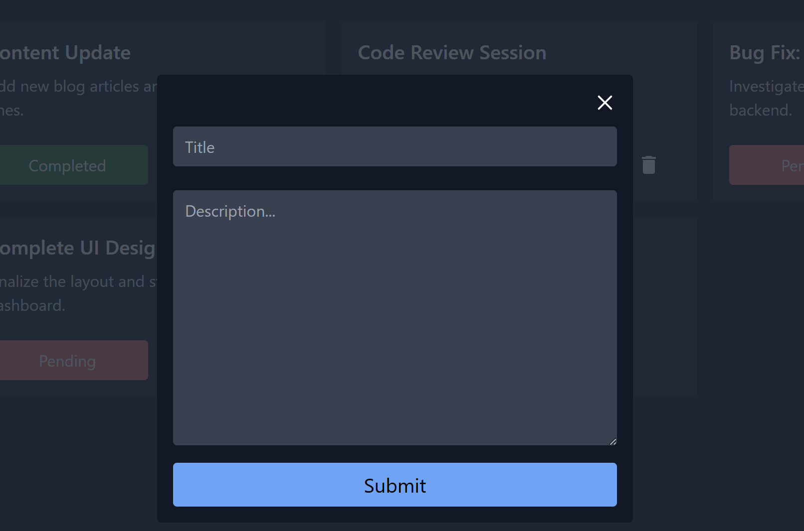
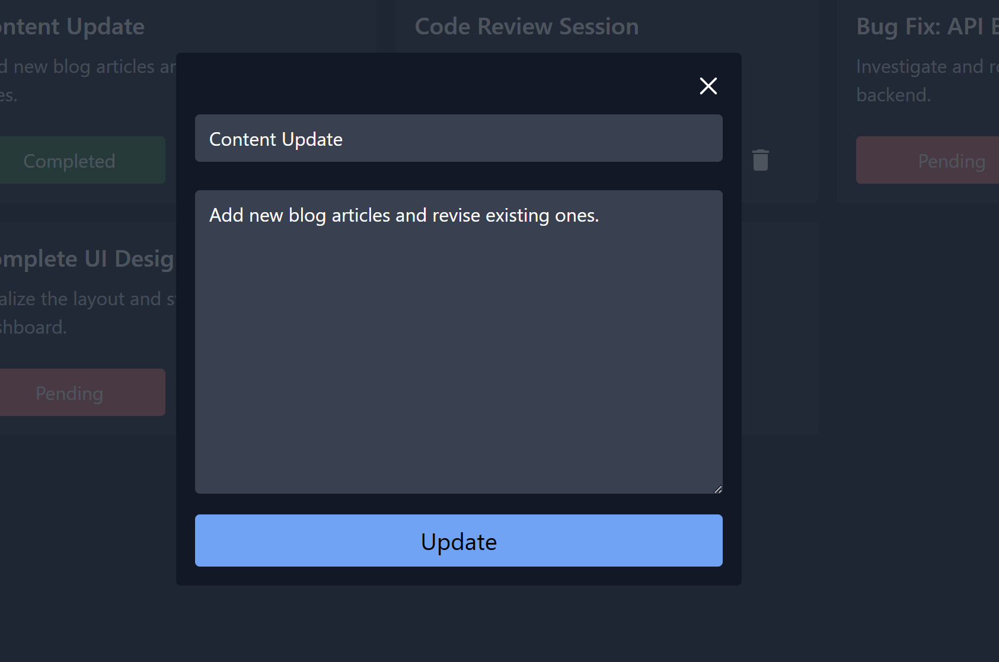
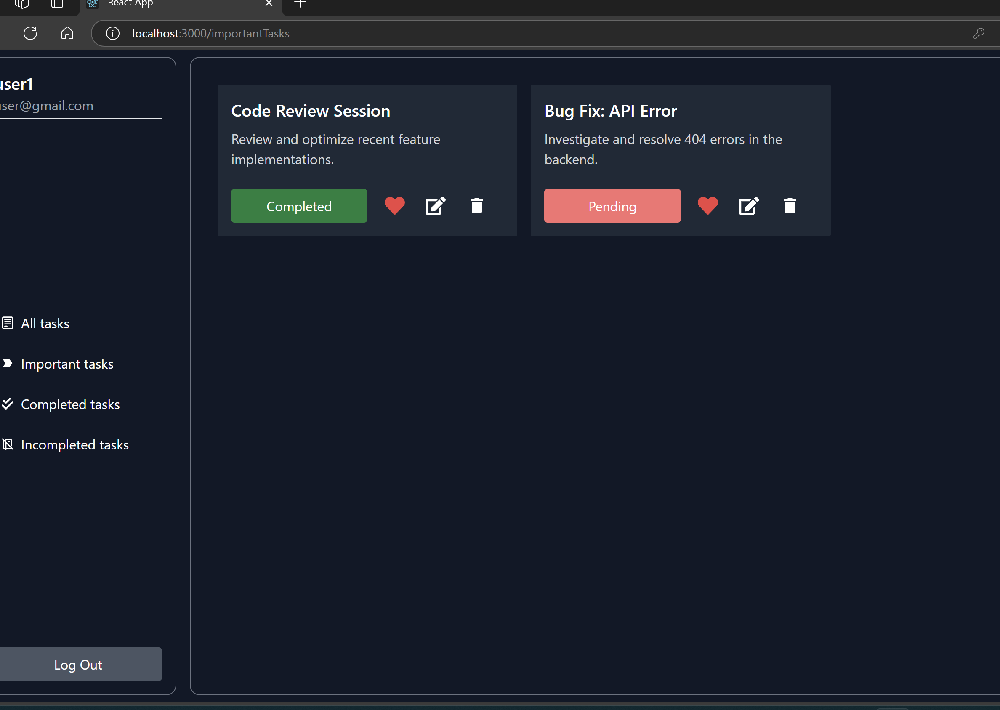
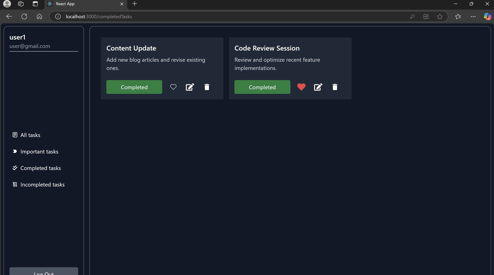
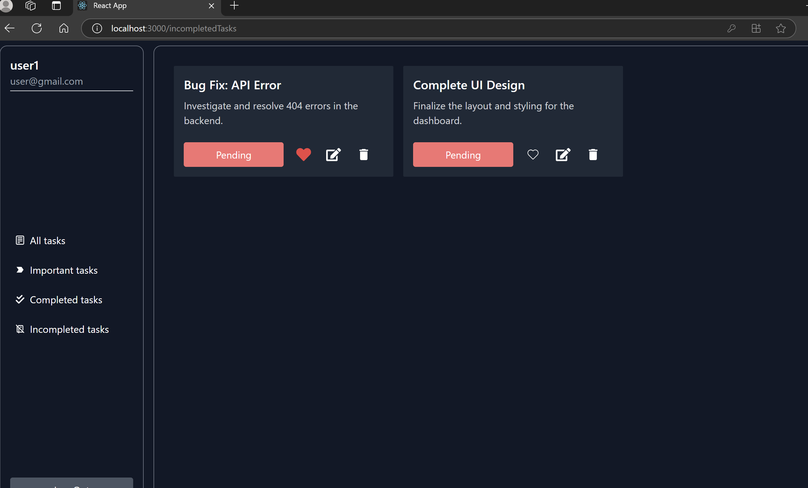
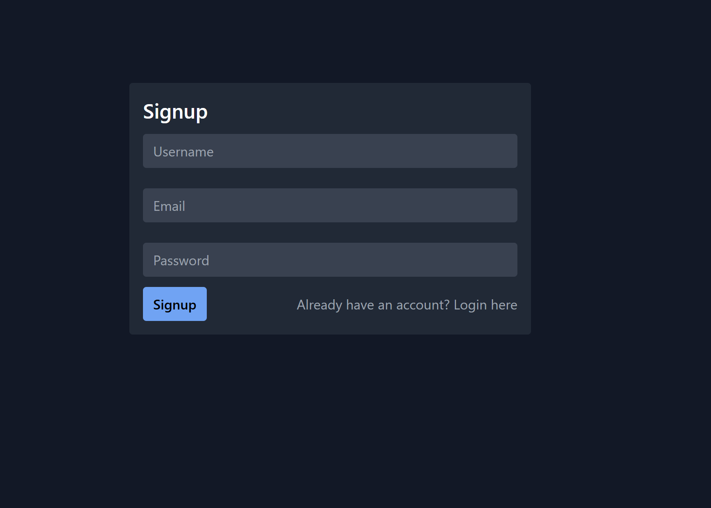

# Task Management Application 📝

A sleek and efficient task management application built with **React.js** for the frontend and **MongoDB** for the backend. The application enables users to **add, edit, delete, and mark tasks as completed** while also categorizing them into important, completed, and pending tasks.

## 🚀 Features

- **User Authentication**: Signup and login functionality.
- **Task Management**: Create, update, and delete tasks.
- **Task Filtering**: View all tasks, important tasks, completed tasks, and pending tasks separately.
- **Status Updates**: Mark tasks as completed or pending.
- **Responsive UI**: Dark-themed, minimal, and easy-to-use interface.

## 🖥️ Screenshots

### 🔹 Dashboard

### 🔹 Add Task Modal

### 🔹 Edit Task Modal

### 🔹 Important Tasks

### 🔹 Completed Tasks

### 🔹 Pending Tasks

### 🔹 Signup Page

### 🔹 Login Page

## 🛠️ Tech Stack

- **Frontend**: React.js, TailwindCSS
- **Backend**: Node.js, Express.js
- **Database**: MongoDB (Mongoose)
- **Authentication**: JWT-based authentication
- **Icons & UI Components**: React Icons

